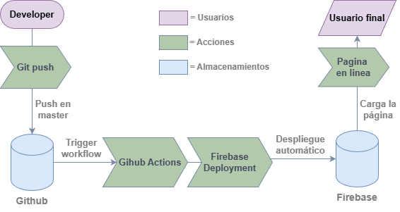

# Portafolio Personal

Este es un portafolio web diseñado para mostrar mis proyectos y experiencia en desarrollo web, data science con Python y desarrollo de juegos.

## Tecnologías utilizadas

- **HTML**: Estructura del sitio web.
- **CSS**: Estilos y diseño visual.
- **JavaScript**: Interactividad y funcionalidad dinámica.
- **Firebase**: Funciones serverless y base de datos para gestionar contenido dinámico.

## Estructura del proyecto

- `index.html` – Página principal con las secciones del portafolio.
- `styles/` – Archivos CSS para el diseño del sitio.
- `scripts/` – Código JavaScript para la interactividad.
- `firebase/` – Configuración y funciones serverless.

## 🚀 Workflow de despliegue automático

Este portafolio se actualiza automáticamente cada vez que se realiza un cambio en el código y se hace un **push** a la rama `master` en GitHub. El flujo de trabajo es el siguiente:

1. **Desarrollador**: Realiza cambios en el código del portafolio.
2. **Git push**: Sube los cambios al repositorio en GitHub.
3. **GitHub Actions**: Se activa un workflow que se encarga de desplegar automáticamente el sitio en Firebase.
4. **Firebase Deployment**: GitHub Actions ejecuta el proceso de despliegue en Firebase Hosting.
5. **Firebase**: Recibe los archivos actualizados y los publica en línea.
6. **Usuario final**: Puede ver la versión más reciente del portafolio en tiempo real.

Este flujo de trabajo garantiza que los cambios en el código sean reflejados en el sitio web sin necesidad de intervención manual adicional.

### 🔹 Diagrama del workflow

